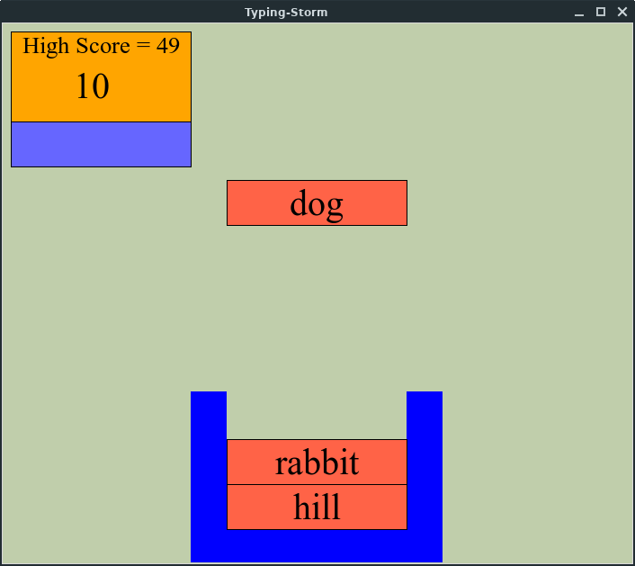

# Typing Storm

Typing Storm helps you to quickly learn typing in an easy and simple manner

## Prerequisites

You need tkinter to run this.
If you are using windows you are ready to go.
For Linux, run this code in terminal if you dont have tkinter installed.
```
sudo apt-get install python3-tk
```

## Screenshot



## Get Started

- clone this repo by typing this command in terminal
```
git clone git@github.com:rohitjoshi21/Typing-Storm.git
```
-when you have cloned the repo, simply run the .py file in terminal 
```
python3 Open.py
```

## Built With

- [tkinter](https://github.com/topics/tkinter) - The GUI framework for Python

## Author

[@rohitjoshi21](https://github.com/rohitjoshi21)
